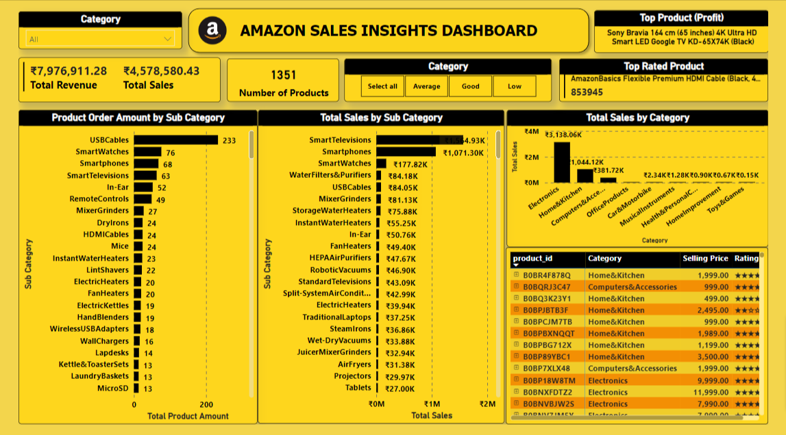

# Amazon-Sales-Power-BI-Dashboard

## 1) Data Used

**Data Description:**

Used a Kaggle Dataset 
"**[Amazon Sales Dataset](https://www.kaggle.com/datasets/karkavelrajaj/amazon-sales-dataset)**" 
. This dataset is having the data of 1K+ Amazon Product's Ratings and Reviews.

Features :
product_id - Product ID
product_name - Name of the Product
category - Category of the Product
discounted_price - Discounted Price of the Product
actual_price - Actual Price of the Product
discount_percentage - Percentage of Discount for the Product
rating - Rating of the Product
rating_count - Number of people who voted for the Amazon rating
about_product - Description about the Product
user_id - ID of the user who wrote review for the Product
user_name - Name of the user who wrote review for the Product
review_id - ID of the user review
review_title - Short review
review_content - Long review
img_link - Image Link of the Product
product_link - Official Website Link of the Product

**Data Cleaning & Analysis:**
Power BI

**Data Visualization:**
Power BI

## 2) Questions

- What are the top-selling products in terms of revenue?
- How do sales vary across different categories and sub-categories?
- How do product prices impact sales volume and revenue trends?
- HHow do discounts or promotions impact sales of specific products or categories?
- What is the customer rating distribution for products in different price ranges?
- What is the total sales per category and sub-category?
- What are the top products by profit  margin?
- What is the total number of products for each category or sub-category, and how does it correlate with sales?
- What is the top product by customer ratings within each category?
- How do different product categories perform in terms of sales and revenue when filtered by customer ratings (average, good, low) and what are the top-selling products within each rating category?

## 3) Summary Findings

- The analysis revealed that the top-selling products in terms of revenue are primarily high-end electronic gadgets and popular home appliances. These products consistently contribute significantly to overall sales and revenue.
- Sales data across different categories and sub-categories showcased varying trends.
- Discounts and promotions were found to have a substantial impact on sales, especially for specific product categories like electronics. Products with limited-time discounts experienced notable spikes in sales, suggesting a strong influence of promotional strategies on customer purchasing decisions.
- Products with higher customer ratings were observed in the mid-price range. Customers appeared to associate moderate pricing with satisfactory product quality, leading to favorable ratings. Products in the high-price range also garnered positive reviews, emphasizing the importance of perceived value for money.
- Products with the highest profit margins were primarily in the "SmartTelevision" category, indicating the potential for strategic pricing adjustments. Identifying and promoting these high-margin products could further boost overall profitability.
- Within each category, products with exceptional customer ratings were often niche or specialized items. Customers' positive experiences with these products indicated a demand for high-quality, unique offerings within various categories.
- Filtering product categories by customer ratings (average, good, low) revealed interesting patterns. Products with "good" ratings consistently outperformed others, indicating a strong preference among customers for products with positive reviews. High-selling products within each rating category were predominantly from the electronics and electronic accessories sectors.
